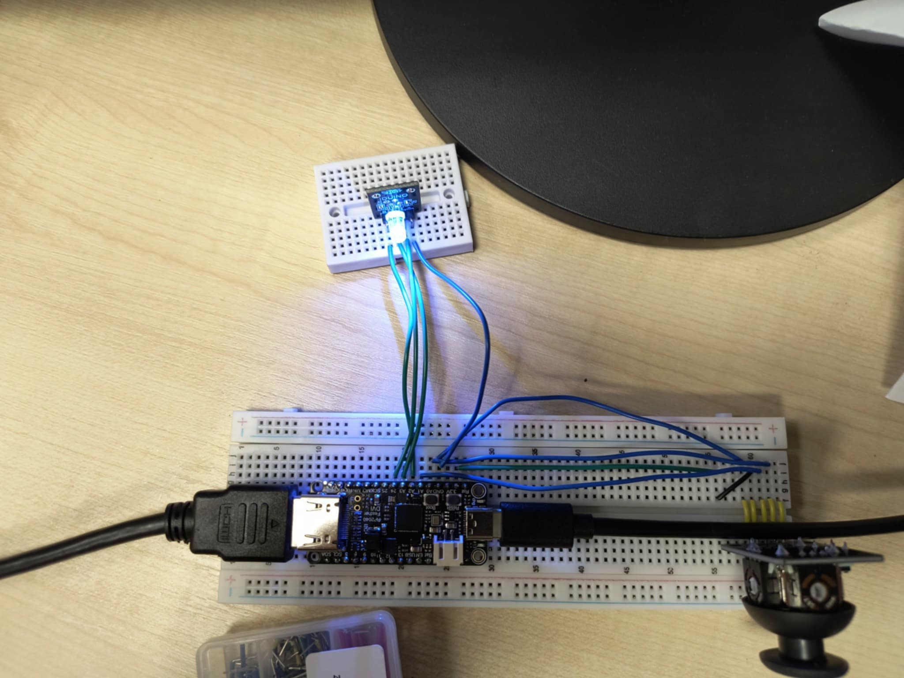
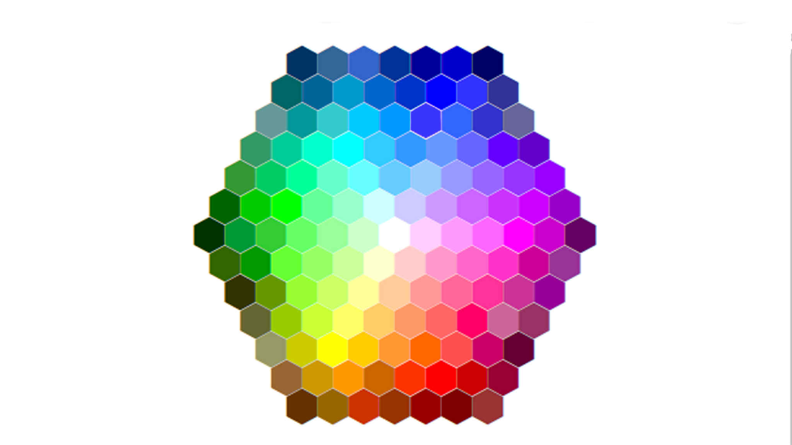

# 🎨 PicoDVI Color Picker & RGB Sampler

> **Project Status:** Completed / Educational 🚀

Welcome to my hardware project! This is a real-time color sampler built on the **Raspberry Pi Pico (RP2040)** platform. It combines high-speed digital video output with analog input processing.

---

## 📑 Table of contents
* [About the Project](#about)
* [Hardware Setup](#hardware)
* [How it Works](#how-it-works)
* [Source Code](#source-code)
* [Authors & Credits](#credits)

---

## 🔍 About 

This project allows a user to navigate a color palette displayed on a DVI monitor using an analog joystick. Once a position is chosen, the system "reads" the pixel color from the framebuffer and reproduces it physically using an RGB LED via PWM (Pulse Width Modulation).

---

## 🛠 Hardware Setup 

 
*Actual project setup featuring Adafruit Feather RP2040 DVI.*

### Components:
* **Microcontroller:** Adafruit Feather RP2040 DVI
* **Input:** 2-axis analog joystick + integrated push-button
* **Output:** DVI monitor (HDMI) & RGB LED
* **Palette:** 320x240 RGB332 Test Card

---

## ⚙️ How it works 

The project utilizes the dual-core architecture of the RP2040:

1. **Video Generation (Core 1):** One core is dedicated solely to the `dvi_serialiser`, pushing pixels from the framebuffer to the DVI interface to ensure a stable 60Hz signal without jitter.
2. **System Logic (Core 0):** The primary core handles the interactive elements:
   * **Joystick Input:** Reads X/Y analog values through the ADC and applies a deadzone filter.
   * **Color Sampling:** When the cursor moves over the palette, the system picks the 8-bit color value (RGB332).
   * **PWM Control:** The selected color is decoded and converted into three independent PWM signals to drive the Red, Green, and Blue channels of the physical LED.

*The hexagon color palette used for sampling.*

---

## 📂 Source Code 

The core logic of this application, including joystick handling and color processing, can be found here:

📍 **Main Application Logic:** [`Color-Picker-project-main\Color-Picker-project-main\software\apps\hello_dvi/main.c`](Color-Picker-project-main\Color-Picker-project-main\software\apps\hello_dvi/main.c)

---

## 👥 Authors & Credits 

This project was developed by me as a hands-on exercise in embedded systems and hardware-software integration.

**Important Acknowledgement:**
The DVI implementation and low-level bit-banging logic are based on the work by **Luke Wren (Wren6991)**. I have adapted this industrial-grade library to handle custom joystick inputs and real-time physical color reproduction.
* Original Library: [Wren6991/PicoDVI](https://github.com/Wren6991/PicoDVI)

---